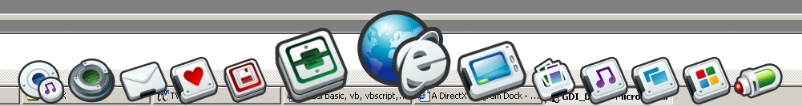



## A GDI\+ Program Dock \(Update \#2\)

### Description

Now you can draw text with each icon and set the the position (top, right, etc.) via gdiPosition variable and I fixed the App.Path thing, the memory leak was allready fixed last time ... Here is the transparent version of my DirectX Program Dock, but this time based on GDI+. Big thanks to Apeiron for his Per Pixel Transparency code which made this version possible. Again you need to create a folder called (“icons”) in App.Path and put some PNG-Files in it. For the screenshot I used a PNG set from http://www.rokey.net/ but you can add any 128x128 PNG files you want.
 
### More Info
 

             |
---                |---
**Submitted On**   |2004-08-06 17:11:02
**By**             |[Peacemaker2000](https://github.com/Planet-Source-Code/PSCIndex/blob/master/ByAuthor/peacemaker2000.md)
**Level**          |Intermediate
**User Rating**    |4.9 (118 globes from 24 users)
**Compatibility**  |VB 6\.0
**Category**       |[Graphics](https://github.com/Planet-Source-Code/PSCIndex/blob/master/ByCategory/graphics__1-46.md)
**World**          |[Visual Basic](https://github.com/Planet-Source-Code/PSCIndex/blob/master/ByWorld/visual-basic.md)
**Archive File**   |[A\_GDI\+\_Pro177892862004\.zip](https://github.com/Planet-Source-Code/peacemaker2000-a-gdi-program-dock-update-2__1-55352/archive/master.zip)

